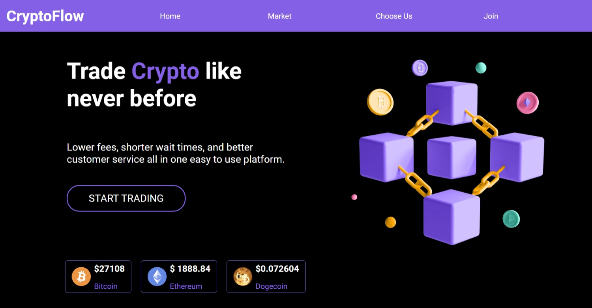

# Description

Development showcase of a modern cryptocurrency exchange website. It consists of HTML, CSS, JavaScript, and jQuery CDN.
It also has an api from CoinGeko and TradingView to fetch the information about the coins.

## Demo

https://ccavanaugh18.github.io/crypto-exchange-project/

## Screenshot

  

