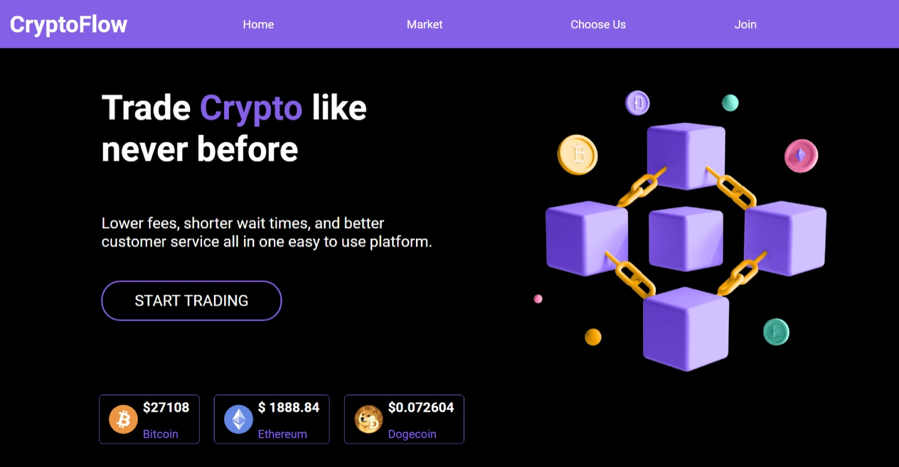

# Description

Development showcase of a modern cryptocurrency exchange website. It consists of HTML, CSS, JavaScript, and jQuery.
It also uses the CoinGeko and TradingView API to get the coin data.

## Demo

https://ccavanaugh18.github.io/crypto-exchange-project/

## Screenshot

  

